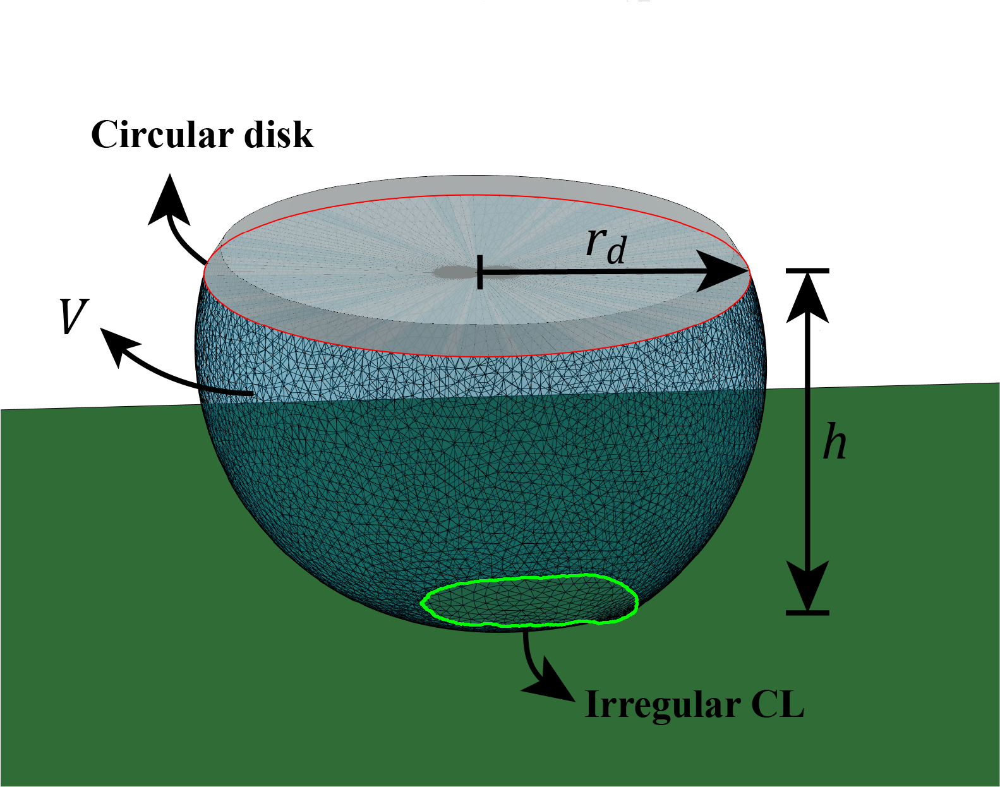

## Introduction
This repository showcases the use of Surface Evolver (supported by MATLAB) for estimating the contact angle along irregularly shaped contact line (CL) of droplets in contact with a surface. More specifically, the droplet is attached to a drop-holding disk (top) while in contact with a surface. The examples cover the hydrophobic case, but philic regime would also be possible, provided the droplet is attached do a disk and the shape of the CL is known. The shape of the CL is typically measured from real-world experiments, e.g. observed through the droplet with a top-view microscope as illustrated in [1].

All MATLAB and Surface Evolver functions are located in the /library folder.

## Requirements
- MATLAB R2020a.
- Surface Evolver 2.70 - binary provided in the /library folder.

## Examples

- **Example 1 - Image to CL** - This example shows how the CL can be obtained by the image of a CL, measured with a top-view optical microscope.

-  **Example 2 - CL to Surface Evolver** - This example uses a MATLAB script to automatically create a surface evolver script. Surface evolver simuations start with a set of xyz point cordinates that define the initial state of a mesh. MATLAB is used to automate this process.

## Concept

A millimiter sized droplet is attached to an undercut disk. The droplet is brought into contact with a surface, as shown in Figure 1 below. The CL is the perimeter of the interface between the droplet and the surface, which is taken as boundary condition to the shape of the water-air interface. The top circular boundary of the disk defines another boundary condition.
Together with the shape of the CL, the geometry is defined by:

r_d - radius of the droplet holding disk.
h - height of the droplet.
V - volume of the droplet.

Figure 1 - Concept illustration.

## References
[1] - Soft-matter.
